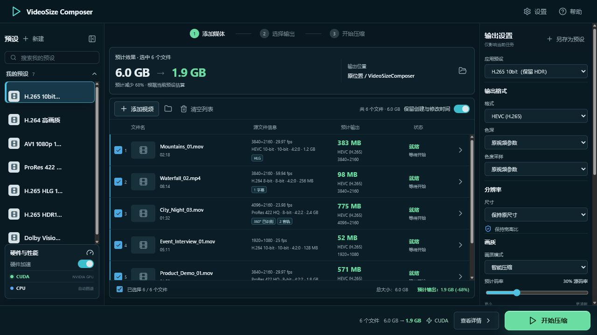
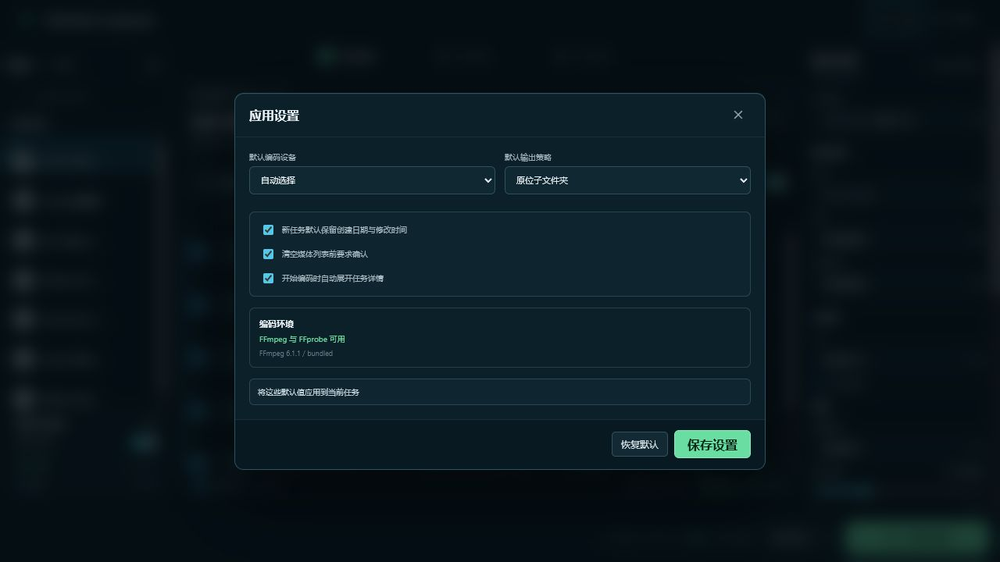
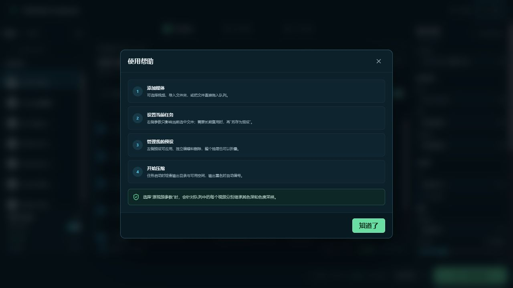

# VideoSize Composer

VideoSize Composer 是一个便携式桌面批量视频编码器。它使用 Tauri v2、React、TypeScript 和 Rust 构建，提供紧凑的液态玻璃工作台，用于导入媒体、配置当前任务并批量压缩视频。

## 界面预览

以下截图来自当前开发版界面，素材保存在 [`assets/readme/`](assets/readme/)：

### 工作台



### 应用设置



### 使用帮助



## 核心流程

1. **添加媒体** — 选择视频、导入文件夹或序列帧媒体，或直接拖放文件；支持批量任务。
2. **选择输出** — 为当前任务选择预设、编码格式、分辨率、画质、色彩和输出命名策略。
3. **开始压缩** — 查看预计大小、剩余时间和任务详情；编码完成、失败或取消都会进入明确的终态。

## 功能特性

- 支持 H.264、H.265/HEVC、AV1 和 ProRes 422 LT；支持源分辨率、短边分辨率、10%–90% 倍率缩放和自定义宽高。
- 输出帧率默认保持源帧率，也可统一为常见帧率（23.976/24/25/29.97/30/50/59.94/60）或输入自定义值。
- 支持从文件夹或任意一帧识别序列帧媒体，并可逐序列设置帧率、分辨率和像素宽幅放大率。
- 输出封装默认保持源后缀（序列帧默认 MP4），也可选择 MP4、MOV、AVI、MKV、WebM、M4V 或 M4A。
- 支持 8/10-bit、4:2:0/4:2:2，以及 SDR、HLG 和 HDR10 色彩模式。
- 通过 FFmpeg `zscale` 完成 HDR/SDR 像素转换并写入匹配的色彩元数据；HDR 转换和 4:2:2 使用 CPU 路径以提高可预测性。
- Dolby Vision 保留模式使用无损 HEVC stream copy 保留已有 RPU；该模式不允许缩放或 LUT 处理，也不会生成新的 Dolby Vision 元数据。
- 可导入 `.cube`、`.3dl` 和 `.lut` 文件，并将 LUT 与预设一起保存。
- 识别带全景标签的源视频和 2:1 等距柱状候选；全景输出写入 Google Spherical Video V1 与标准 V2 `st3d`/`sv3d` 元数据，并通过 ffprobe 回读验证。
- 可保存、编辑和删除“我的预设”；预设库与右侧当前任务的输出设置相互独立。
- 可选择全部输出到指定目录、原位输出或原位子文件夹，并支持原名或前后缀命名。
- 默认保留源视频的创建日期和修改时间；Windows 与 macOS 会分别写入并回读验证。
- 启动编码前检查输出目录可写性和剩余空间；重名文件使用可预测的数字后缀处理。
- 编码使用同目录临时文件，成功后才移动到最终路径；失败、取消时会清理临时文件。
- 运行中的任务可以取消；任务详情、日志和错误状态保持可见。

## 平台行为

- Windows 显示 `CUDA`、`Auto` 和 `CPU`，不显示 Metal。
- macOS 显示 `Metal`、`Auto` 和 `CPU`，不显示 CUDA。
- 其他平台显示 `Auto` 和 `CPU`。

## 默认预设

- H.265 10bit（保留 HDR）
- H.264 高画质
- AV1 1080p 10bit
- ProRes 422 LT
- H.265 HLG 10bit
- H.265 HDR10 10bit
- Dolby Vision 保留导出

## 技术栈

- Tauri v2 桌面壳
- React + TypeScript + Vite 前端
- Rust 后端命令负责平台检测、预设、ffprobe 元数据、FFmpeg 命令构建、编码进度和时间戳验证
- FFmpeg / ffprobe 从 `PATH` 获取，或随打包应用一起内置

## 开发

开始原生开发前，请安装 Rust stable、Node.js 或 pnpm，以及对应平台的 WebView2/Xcode 工具链。

```powershell
pnpm install
pnpm tauri dev
```

构建前端：

```powershell
pnpm build
```

## 便携版构建

```powershell
pnpm build:portable
```

Windows 便携版会生成到 `dist/VideoSizeComposer`，直接运行其中的 `VideoSizeComposer.exe`。最终打包步骤会把 FFmpeg 和 ffprobe 放在应用旁边。

macOS `.app` 包请在 macOS 上构建：

```bash
pnpm build:mac
```

## 验证

```powershell
pnpm build
cd src-tauri
cargo test
```

Rust 测试覆盖编码器组合、HDR、LUT、全景元数据、导入、重名、临时文件、取消任务，以及创建/修改时间独立恢复等关键路径。
