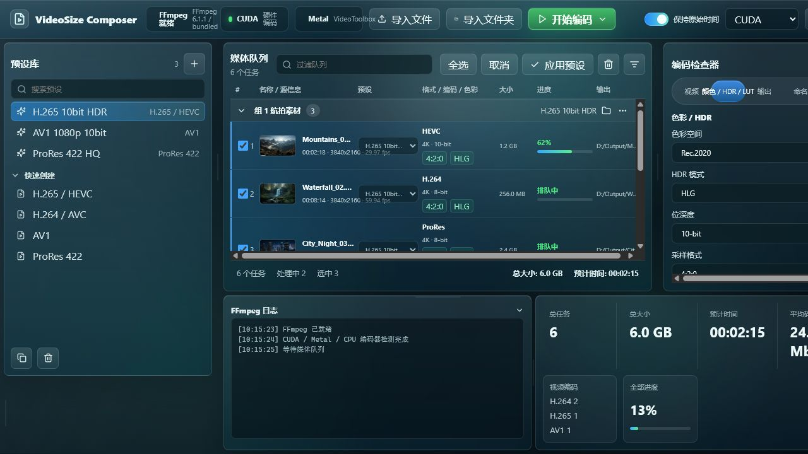
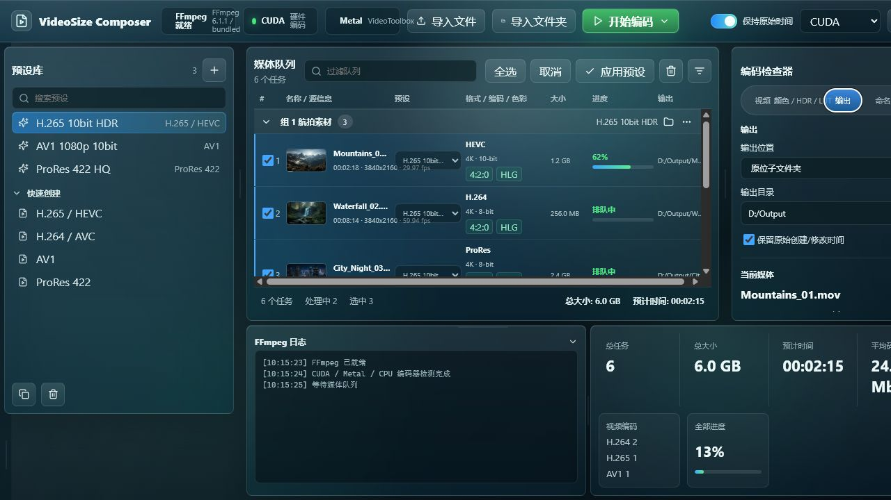
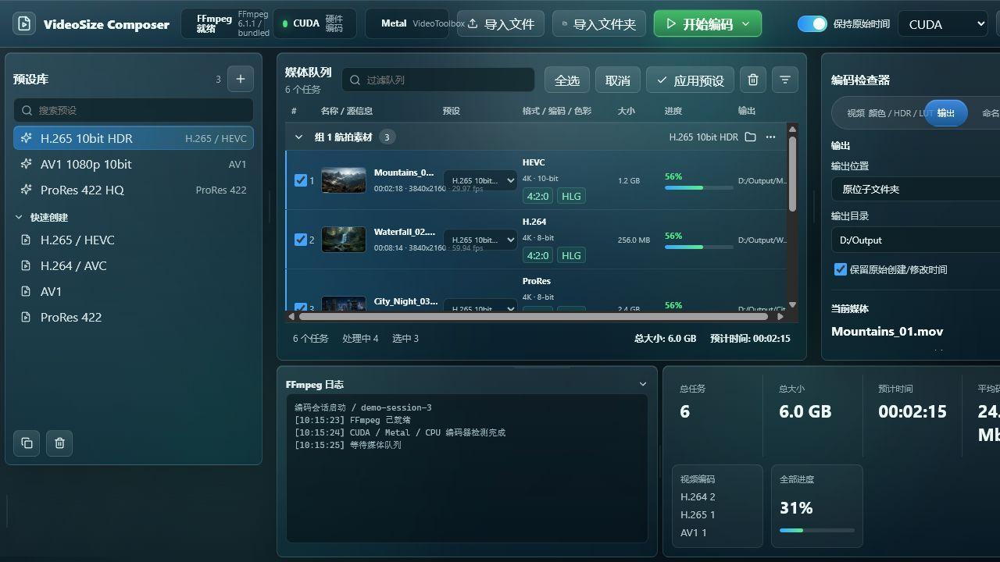
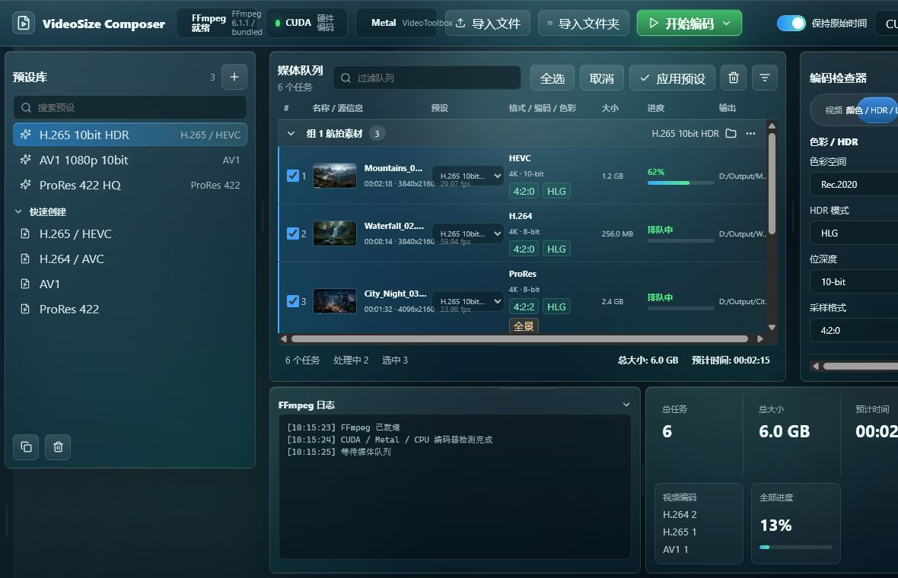

# VideoSize Composer 基线审计

日期：2026-07-10  
范围：当前桌面主工作台，重点检查“准备媒体 → 配置输出 → 启动编码 → 判断结果”主流程。  
证据：本次运行产生的截图、DOM 状态、前端生产构建、Rust 编码测试与当前源码。

## 总体结论

当前版本有可运行的 Tauri/React/Rust 基础，FFmpeg 参数构建和多个真实编码路径也通过了自动测试；但产品体验尚未达到“用户可以放心完成批量压缩”的标准。最关键的问题不是视觉风格，而是窗口适配、结果预测、预检、任务状态一致性与高风险色彩功能的真实性。

## 流程证据

### 1. 已填充的批量工作台 — 风险较高

- 优点：媒体、预设、输出配置和编码入口都可发现；缩略图、源信息和逐项进度具备专业工具的基本信息密度。
- UX 风险：在 1280×720 的真实窗口中出现横向滚动和右侧/底部内容裁切。用户无法同时看清队列、输出配置和汇总结果。
- 层级风险：FFmpeg、CUDA、Metal、预设、LUT、队列、日志、统计和检查器同时竞争注意力，主任务没有形成明确的先后顺序。
- 无障碍风险：可拖拽分隔条只有指针操作；未发现键盘调整机制。若图标按钮缺少可见标签，低视力和认知负担较高的用户更难判断动作。

### 2. 输出配置 — 基本可用，但缺少预检

- 优点：输出位置、目录和时间戳保留可以在同一上下文中编辑。
- UX 风险：界面显示目录，但没有可见的可写性、剩余空间、重名冲突或覆盖策略验证。
- 信任风险：“预计时间 00:02:15”显示为精确值，但当前实现没有基于实际设备性能建立可解释的估算模型。

### 3. 编码进行中 — 有反馈，但信息不一致

- 优点：主按钮变为禁用的“编码中”，行进度、总进度和日志都会变化。
- UX 风险：没有暂停、取消或逐项重试入口；用户无法控制长任务。
- 状态风险：队列原有的“处理中”项目和本次新会话混在一起，总数与当前会话边界不清楚。

### 4. 模拟编码停止在 56% — 不可接受

- 触发方式：在浏览器演示环境中选择三个任务并点击“开始编码”，等待模拟会话结束。
- 观察：主按钮恢复为“开始编码”，三个任务却停在 56%，总进度停在 31%，没有成功、失败或中止说明。
- 影响：这是结果可信度的阻断问题。用户无法判断文件是否已经输出，也不知道下一步应重试、打开目录还是检查错误。

### 5. 配置声明的最小窗口 1180×760 — 不通过

- 测试尺寸与 `tauri.conf.json` 的 `minWidth: 1180`、`minHeight: 760` 一致。
- 观察：顶部硬件选择器被右边界截断；检查器内容超出可视区；底部“预计时间”等摘要被截断；队列表格需要横向滚动才能访问输出列。
- 根因证据：全局样式给 `body` 设置了 `min-width: 1280px`，与原生窗口允许的 1180px 最小宽度直接冲突。
- 影响：这是产品承诺与实现不一致，不属于视觉微调问题。新设计必须在最小窗口完成无裁切验证。

## 工程基线

- `pnpm build`：通过。
- `cargo test`：7/7 通过，包括 H.264、H.265、AV1 10-bit HLG、ProRes 422、LUT 强度、时间戳和输出重名路径测试。
- 当前测试证明部分 FFmpeg 命令能产出可探测的文件，但没有证明完整桌面任务流、取消/重试、预检、失败清理、窗口适配或色彩转换正确。

## 高优先级产品与技术风险

1. **色彩/HDR 语义不安全。** 当前设置主要写入色彩元数据；改变 Rec.709/Rec.2020、SDR/HLG/HDR10 并不等于真正执行色彩空间转换或色调映射。Dolby Vision 也不能只靠 PQ 标签实现。
2. **“自动”硬件并非真正自动。** 编码器选择中 `auto` 会落到软件编码，并未根据已检测的实际编码器择优选择。
3. **工具健康状态不完整。** 顶部“就绪”主要由 FFmpeg 是否存在决定，ffprobe 缺失仍可能在导入时才失败。
4. **导入错误被吞掉。** 单个文件探测失败只写标准错误，UI 只拿到成功项目，缺少逐文件失败摘要。
5. **输出预检不足。** 没有在启动前验证目录权限、空间、重名策略和目标编码器/像素格式组合。
6. **任务控制不足。** 后端按顺序运行任务，没有取消、暂停、重试、会话持久化或崩溃恢复协议。
7. **失败文件处理不明确。** FFmpeg 失败后可能留下不完整输出；产品没有明确标记、清理或保留策略。

## 证据边界

- 浏览器演示环境无法验证系统文件选择器、原生拖放、真实 GPU 编码、Windows 创建时间写入和打包后 WebView 行为。
- 截图只能指出可见的无障碍风险，不能证明屏幕阅读器兼容或完整键盘可达性。
- 自动编码测试使用短合成素材，不能替代长视频、可变帧率、多音轨、字幕、旋转、全景和真实 HDR 素材矩阵。
